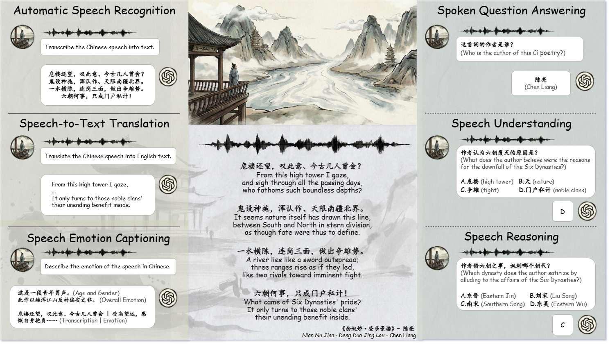

# MCGA: A Multi-task Classical Chinese Literary Genre Audio Corpus
<div align="right">
  
</div>
<div style="text-align: justify;">
MCGA (Multi-task Classical Chinese Literary Genre Audio Corpus) is the first large-scale, open-source, and fully copyrighted audio corpus dedicated to Classical Chinese Studies, comprising 119 hours (22,000 samples) of standard Mandarin recordings by native speakers that span five major literary genres (Fu, Shi, Wen, Ci, and Qu) across 11 historical periods, specifically constructed to support six core speech-centric tasksAutomatic Speech Recognition (ASR), Speech-to-Text Translation (S2TT), Speech Emotion Captioning(SEC), Spoken Question Answering(SQA), Speech Understanding(SU), Speech Reasoning(SR) to bridge the gap in domain-specific audio resources and advance the multidimensional capabilities of Multimodal Large Language Models.
</div>

- **Language**: Chinese
- **Data Size**: 22,000 sample, 119hour
- **Data Split**: Train / Val / Test
- **Data Source**: Native speakers (13 males and 15 females)
- **Domain**: Classical Chinese Literary Study
- **Literary Genre**: Fu (Rhapsody), Shi (Poetry), Wen (Prose), Ci (Lyric), and Qu (Song)
- **Task**: ASR, S2TT, SEC, SQA, SU, SR
- **Huggingface**: 🤗 <a href="https://huggingface.co/datasets/yxdu/MCGA" target="_blank">Hugging Face</a>
- **Paper**: 📄 <a href="https://arxiv.org/abs/2601.09270" target="_blank">Paper</a>
- **License**: CC BY-NC-SA-4.0


> **Note:** The **Test split** is released first for fair benchmarking.
> The full dataset will be available soon.
## Installation
```
git clone https://github.com/yxduir/MCGA
cd MCGA

# Install uv (if not already installed)
curl -LsSf https://astral.sh/uv/install.sh | sh

uv venv --python 3.10
source ./venv/bin/activate
uv pip install -r requirements.txt
```
## Download Model、Data、Inference、Eval
```
# Optional: DeepSeek API key only for S2TT and SEC task evaluation, 
export DEEPSEEK_API_KEY="your-deepseek-api-for-s2tt-sec-task-optional"

bash vllm_infer.sh \
    "Qwen/Qwen2.5-Omni-7B" \
    "0" \
    8901 \
    "asr,s2tt,sec,sqa,su,sr" \
    "audio" \
    "test" \
    16 \
    "localhost" \
    "sk-openai-key-optional" \
    "https://api.openai.com/v1" \
    "true" \
    "true"
```
| Pos | Name | Description | Default |
| :--- | :--- | :--- | :--- |
| `$1` | `Model` | VLLM-supported audio model or Api:<br>• `Qwen/Qwen3-Omni-30B-A3B-Instruct`, `Qwen/Qwen2.5-Omni-7B`<br>• `mistralai/Voxtral-Small-24B-2507`, `mistralai/Voxtral-Mini-3B-2507`<br>• `microsoft/Phi-4-multimodal-instruct`<br>• `GPT-4o-mini-Audio`（for Api） | `"Qwen/Qwen2.5-Omni-7B"` |
| `$2` | `GPUs` | GPU ID. Use commas for multiple GPUs. (e.g. `0,1`) | `"0"` |
| `$3` | `Port` | Port for the vLLM server (local or remote) | `8901` |
| `$4` | `Tasks` | Evaluation tasks | `"asr,s2tt,sec,sqa,su,sr"` |
| `$5` | `Mode` | Input modality: `audio` or `text` | `"audio"` |
| `$6` | `Split` | Dataset split (currently supports `test` only). | `"test"` |
| `$7` | `Workers` | Number of parallel API request threads | `16` |
| `$8` | `Ip` | `localhost` or remote VLLM server IP (e.g. `192.168.138.182`) | `localhost` |
| `$9` | `API-Key` | Optional. Required only for `GPT-4o-mini-Audio` | `"sk-xxxx"` |
| `$10` | `API-URL` | Optional. Required only for `GPT-4o-mini-Audio` | `"https://api.openai.com/v1"` |
| `$11` | `Kill-Server` | Whether to terminate `localhost` vLLM server after inference. | `"true"` |
| `$12` | `Eval` | Whether to trigger execute after inference. | `"true"` |

## 🖊Citation
```
@misc{du2026mcgamultitaskclassicalchinese,
      title={{MCGA}: A Multi-task Classical Chinese Literary Genre Audio Corpus}, 
      author={Yexing Du and Kaiyuan Liu and Bihe Zhang and Youcheng Pan and Bo Yang and Liangyu Huo and Xiyuan Zhang and Jian Xie and Daojing He and Yang Xiang and Ming Liu and Bin Qin},
      year={2026},
      eprint={2601.09270},
      archivePrefix={arXiv},
      primaryClass={cs.CL},
      url={https://arxiv.org/abs/2601.09270}, 
}
```
